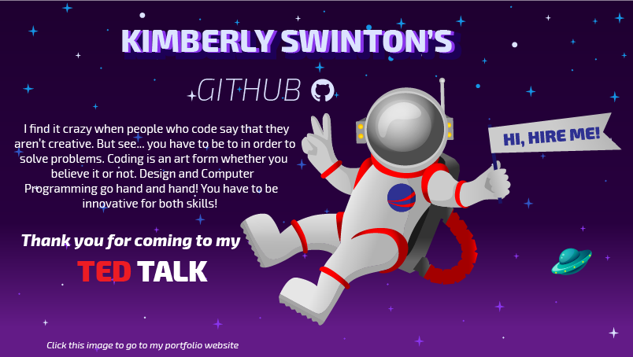

### Projects &nbsp; 🔭

#### ksswinton.com ⦁•● JavaScript | React | Styled Components | React Spring | React Hook Form | EmailJS | Adobe Illustrator | Adobe Xd | 🌍[website](ksswinton.com) :octocat:[github](https://github.com/KSSwimmy/portfolio_V3)

- Portfolio website displaying projects and my love for space
- Built Front End with ReactJS (React JavaScript)
- Used Styled Components for CSS styling, React Spring for the parallax effect, Font Awesome for most icons (The Adobe icons I had to create from scratch), EmailJS for sending any messages from the form on the site to my email, and finally React Hook Form to easily create a form
- Designed the planets, stars, and ect using Adobe Illustrator
- Assembled the page layout in Adobe Xd

