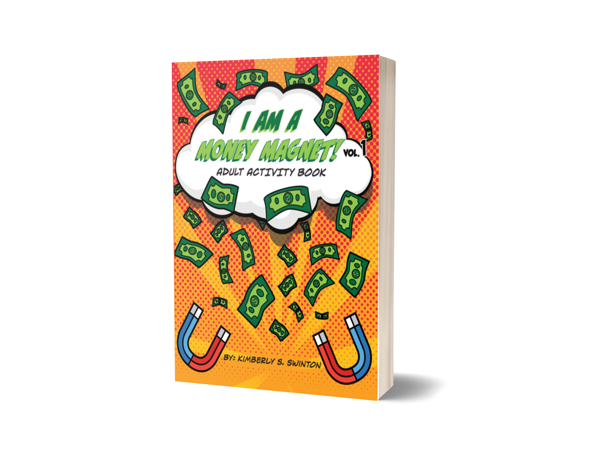
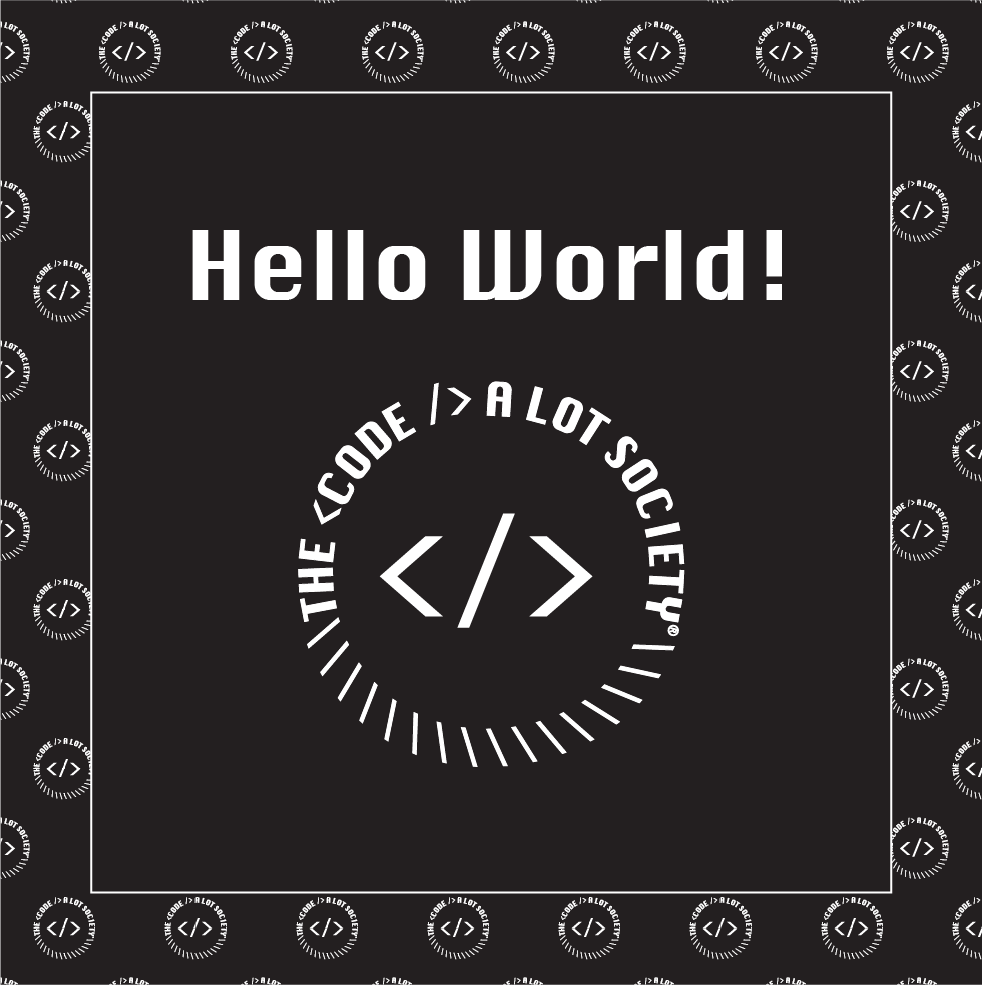

---

### Projects &nbsp; 🔭

#### ksswinton.com ⦁•● JavaScript | React | Styled Components | React Spring | React Hook Form | EmailJS | Adobe Illustrator | Adobe Xd | 🌍 [website](ksswinton.com) :octocat: [github](https://github.com/KSSwimmy/portfolio_V3)

- Portfolio website displaying projects and my love for space
- Built FrontEnd with ReactJS (React JavaScript)
- Used Styled Components for CSS styling 
- React Spring for the parallax effect
- Font Awesome for most icons (The Adobe icons I had to create from scratch)
- EmailJS for sending any messages from the form on the site to my email
- React Hook Form was implemented to easily create a form using React Hooks
- Designed the planets, stars, and ect using Adobe Illustrator
- Assembled the page layout in Adobe Xd

#### Bookr App (BackEnd) ⦁•● Java/Spring Boot | Maven | Hibernate | PostgreSQL | Swagger | Postman | Adobe Illustrator | Adobe Xd | OAuth2 | 🌍 [website](https://bookr.vercel.app/login) :octocat: [github](https://github.com/BW-BookR-2019/BE)

- An app that allows its users to review books
- Built BackEnd with Java/Spring Boot
- Deployed using Maven (While using IntelliJ as an IDE)
- Built the database using PostgreSQL
- Connected FrontEnd Devs using Swagger 
- Built and checked the functionality of the CRUD **(CREATE READ UPDATE and DELETE)** API requests using Postman
-  Adobe Illustrator was used to create the UI page layout

*Personally, I'd like to come back and rebuild this project, however I'd prefer to use open source APIs to help out with the backend. Or maybe I'll build it using C++ 🤔*

#### Ori's Galaxy Quest (FrontEnd & BackEnd) ⦁•● React | Python | Django | Postman | Adobe Illustrator | Adobe Xd | 🌍 [website](https://cocky-davinci-344c63.netlify.app/) :octocat: [github](https://github.com/Cakewalk-CS)

- built an interactive Multi-User Dungeon (MUD) client and server in groups.
***Backend*** 
- Built the backend using Python & Django framework
- Built and checked the functionality of the CRUD **(CREATE READ UPDATE and DELETE)** API requests using Postman
***Frontend*** 
- ReactJS
- Adobe Illustrator and Xd were used to design the landing page's layout and functionality

---
### Work ⏰

#### Lambda School &nbsp;|&nbsp;&nbsp;Team Lead

- Serving as a teaching assistant leading a team of 10+ Software Engineering students in daily code challenges in JS, Java, and/or Python 

- Leading daily standup meetings and individual teammate 1:1s via Zoom to build camaraderie, weekly goals, facilitate the sharing of ideas and work progress, and provide guidance for that week’s material 

- Grading assignments and providing daily feedback on career artifacts, website, personal projects and issue resolution of the entire Full Stack Web Development curriculum through slack help channel or code review 

- Delivering supplemental lectures on various topics related to software engineering

---

### Hobbies 🎨 (AKA Side Hustles) 💸 

<table>
  <tr>
    <th>Author/Illustrator.</th>
    <th>Clothing Brand</th>
    <th>Graphic Design</th>
    
  </tr>
  <tr>
    <td> 
         
    </td>
    <td>
        <a href="https://www.tcals10k.com/">
        
    </td>
    <td>
        <a href="https://www.tcals10k.com/">
        
        </td>
  </tr>
  <tr>
    <td>I Am A Money Magnet! Vol. 1: Adult Activity Book</td>
    <td>The Code A Lot Society</td>
    <td>Brand & Identity </td>
  </tr>
</table>

